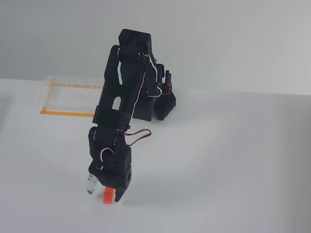
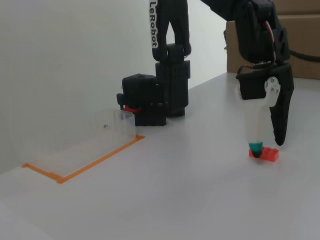

# Dataset Inspection Report: `lerobot/svla_so101_pickplace`

_Generated: 2026-05-10T14:53:43_
_Generated by: `scripts/inspect_so101.py`_

## Dataset Metadata

| Property | Value |
|---|---|
| Repo ID | lerobot/svla_so101_pickplace |
| Source | https://huggingface.co/datasets/lerobot/svla_so101_pickplace |
| Total episodes | 50 |
| Total frames | 11939 |
| FPS | 30 |
| Robot type | so100_follower |
| Camera keys | observation.images.up, observation.images.side |
| Image keys | (none) |
| Video keys | observation.images.up, observation.images.side |
| Total tasks | 1 |

## Feature Schema (declared by dataset metadata)

| Field | dtype | shape | notes |
|---|---|---|---|
| `action` | float32 | (6,) | axis_names=['shoulder_pan.pos', 'shoulder_lift.pos', 'elbow_flex.pos', 'wrist_flex.pos', 'wrist_roll.pos', 'gripper.pos'] |
| `observation.state` | float32 | (6,) | axis_names=['shoulder_pan.pos', 'shoulder_lift.pos', 'elbow_flex.pos', 'wrist_flex.pos', 'wrist_roll.pos', 'gripper.pos'] |
| `observation.images.up` | video | (480, 640, 3) | codec=None fps=None axis_names=['height', 'width', 'channels'] |
| `observation.images.side` | video | (480, 640, 3) | codec=None fps=None axis_names=['height', 'width', 'channels'] |
| `timestamp` | float32 | (1,) |  |
| `frame_index` | int64 | (1,) |  |
| `episode_index` | int64 | (1,) |  |
| `index` | int64 | (1,) |  |
| `task_index` | int64 | (1,) |  |

## Episode-Length Distribution (full dataset)

- **Total episodes:** 50
- **Frames per episode:** min=183, max=306, mean=238.8, median=230.0, std=30.8

Histogram (10 fixed-width buckets across observed range):

| Frames-per-episode range | Episode count |
|---|---|
| 183 – 195 | 1 |
| 195 – 208 | 7 |
| 208 – 220 | 6 |
| 220 – 232 | 13 |
| 232 – 244 | 5 |
| 244 – 257 | 3 |
| 257 – 269 | 5 |
| 269 – 281 | 5 |
| 281 – 294 | 2 |
| 294 – 306 | 3 |

## Aggregated Field Stats (across 200 sampled frames)

| Field | dtype | shape | min | max | mean | std |
|---|---|---|---|---|---|---|
| `observation.images.up` | torch.float32 | (3, 480, 640) | 0.0000 | 1.0000 | 0.6003 | 0.1426 |
| `observation.images.side` | torch.float32 | (3, 480, 640) | 0.0000 | 0.9373 | 0.4727 | 0.1714 |
| `action` | torch.float32 | (6,) | -99.9158 | 99.5448 | 9.1702 | 53.9902 |
| `observation.state` | torch.float32 | (6,) | -98.8275 | 99.0139 | 9.7451 | 53.9875 |
| `timestamp` | torch.float32 | () | 0.0000 | 10.0000 | 4.4502 | 2.6689 |
| `frame_index` | torch.int64 | () | 0.0000 | 300.0000 | 133.5050 | 80.0667 |
| `episode_index` | torch.int64 | () | 0.0000 | 2.0000 | 0.9100 | 0.8156 |
| `index` | torch.int64 | () | 0.0000 | 798.0000 | 398.5050 | 231.9596 |
| `task_index` | torch.int64 | () | 0.0000 | 0.0000 | 0.0000 | 0.0000 |
| `task` | str | scalar | — | — | — | — |

## Raw Sample Frames

### Sample 1 (dataset index 0)

- `observation.images.up`: torch.float32 (3, 480, 640) min=0.0000 max=0.8667 mean=0.6151
- `observation.images.side`: torch.float32 (3, 480, 640) min=0.0000 max=0.9294 mean=0.4930
- `action`: torch.float32 (6,) min=-99.4105 max=99.5448 mean=4.9978
- `observation.state`: torch.float32 (6,) min=-98.7437 max=98.9242 mean=4.4855
- `timestamp`: torch.float32 scalar = 0.0
- `frame_index`: torch.int64 scalar = 0.0
- `episode_index`: torch.int64 scalar = 0.0
- `index`: torch.int64 scalar = 0.0
- `task_index`: torch.int64 scalar = 0.0
- `task`: str = 'pink lego brick into the transparent box'

### Sample 2 (dataset index 399)

- `observation.images.up`: torch.float32 (3, 480, 640) min=0.0000 max=0.7725 mean=0.5728
- `observation.images.side`: torch.float32 (3, 480, 640) min=0.0000 max=0.8471 mean=0.4458
- `action`: torch.float32 (6,) min=-50.2320 max=47.1313 mean=10.4549
- `observation.state`: torch.float32 (6,) min=-50.1832 max=46.8419 mean=10.9751
- `timestamp`: torch.float32 scalar = 3.200000047683716
- `frame_index`: torch.int64 scalar = 96.0
- `episode_index`: torch.int64 scalar = 1.0
- `index`: torch.int64 scalar = 399.0
- `task_index`: torch.int64 scalar = 0.0
- `task`: str = 'pink lego brick into the transparent box'

### Sample 3 (dataset index 798)

- `observation.images.up`: torch.float32 (3, 480, 640) min=0.0000 max=0.8863 mean=0.6557
- `observation.images.side`: torch.float32 (3, 480, 640) min=0.0039 max=0.9333 mean=0.4977
- `action`: torch.float32 (6,) min=-99.2421 max=99.5448 mean=1.9223
- `observation.state`: torch.float32 (6,) min=-98.4925 max=99.0139 mean=1.8586
- `timestamp`: torch.float32 scalar = 7.633333206176758
- `frame_index`: torch.int64 scalar = 229.0
- `episode_index`: torch.int64 scalar = 2.0
- `index`: torch.int64 scalar = 798.0
- `task_index`: torch.int64 scalar = 0.0
- `task`: str = 'pink lego brick into the transparent box'

## Sample Images

### `observation.images.up`

### `observation.images.side`

## Key Findings (vs PushT)

- **Multi-camera dataset:** 2 cameras (`observation.images.up, observation.images.side`). PushT had 1; SO-101 datasets typically have 2-3. Implication for image-based policies: vision encoder must handle multiple camera streams (LeRobot supports this via `use_separate_rgb_encoder_per_camera`).
- **State dimensionality:** 6D (range -98.83 to 99.01). SO-101 has 6 joints; if dim ≠ 6, the dataset includes extra channels (gripper open/close, end-effector pose, etc.).
- **Action dimensionality:** 6D (range -99.92 to 99.54).
- **Sampling rate:** 30 fps. Higher than PushT (10 fps) — implies smoother trajectories and longer episodes for the same task duration.
